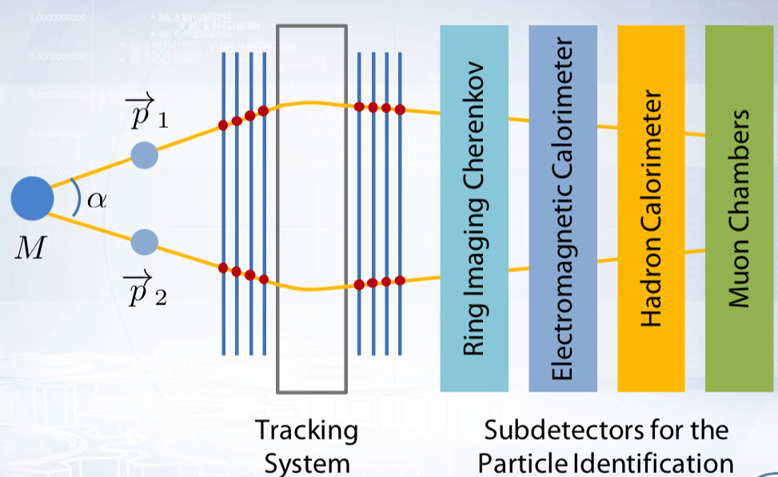
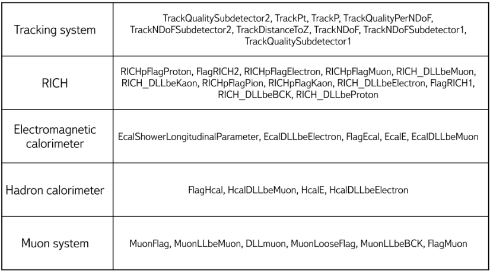
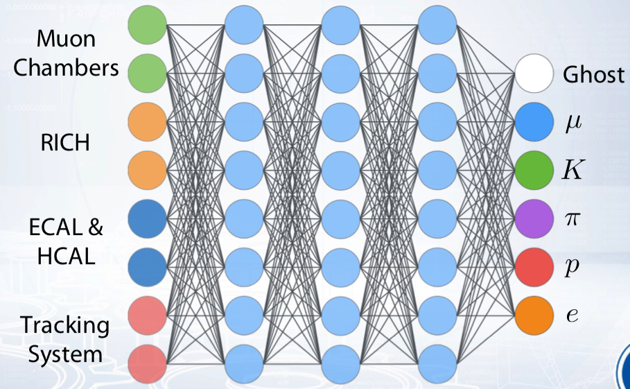

# Particle-Identification
physicists identify subatomic particles from the traces they leave in detectors

Accelerators at CERN boost particles to high energies before they are made to collide inside detectors. The detectors gather clues about the particles – including their speed, mass and charge – from which physicists can work out a particle's identity.

## Broadly The Detector has these components :-

### Tracking devices
Tracking devices reveal the paths of electrically charged particles as they pass through and interact with suitable substances

### Calorimeters
A calorimeter measures the energy a particle loses as it passes through. It is usually designed to stop or absorb most of the particles coming from a collision, forcing them to deposit all of their energy within the detector.

### Particle-identification detectors
Once a particle has passed through the tracking devices and the calorimeters, physicists have two further methods of narrowing down its identity. Both methods work by detecting radiation emitted by charged particles, Cherenkov radiation and Transition radiation

My task is to train a classifier to identify type of a particle. There are six particle types: electron, proton, muon, kaon, pion and ghost. Ghost is a particle with other type than the first five or a detector noise.

Different particle types remain different responses in the detector systems or subdetectors. Thre are five systems: tracking system, ring imaging Cherenkov detector (RICH), electromagnetic and hadron calorimeters, and muon system.

In this project I used LHCb detector's data. Data consists of 50 features which describe particle responses in the 5 detector systems.

Each feature describes particle responses of a particular detector system :-

I trained a neural network classifier with 6 classes, to identify particles

I got accuracy of 74%
